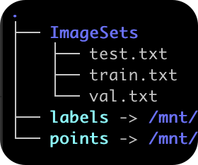
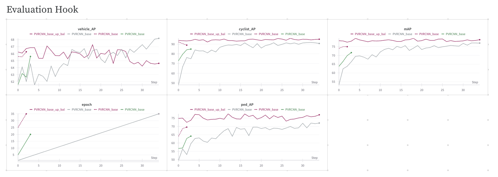

# Lidar sensor, edge-infra 3D 객체탐지 challenge
Lidar dataset을 이용하여  3D 객체 탐지하는 [challenge](https://www.auto-dna.org/page/?M2_IDX=32625)의 솔루션.
최종 리더보드 기준 3rd place score

## 환경세팅
**도커 혹은 conda, 둘중 하나를 이용해서 환경세팅**
-  Docker사용(권장)
```bash
cd docker_script
./make_image.sh # 도커 이미지 생성
./run_image.sh # 컨테이너 생성

cd python setup.py develop
```

- Conda 사용
```bash
apt-get install -y git zip build-essential cmake libssl-dev python3-dev  python3-pip python3-pip cmake ninja-build git wget ca-certificates ffmpeg libsm6 libxext6

git clone https://github.com/ies0411/dna_edge.git
cd DNA_challenge

conda env create -f environment.yml
conda activate dna

pip install -r requirements.txt
python setup.py develop
```
## Preparing Dataset
1. [Datasets](https://nanum.etri.re.kr/share/kimjy/3DMODInfraAIchallenge2024?lang=ko_KR)에서 lidar dataset(edge case)를 다운.
2. 폴더트리는 아래의 그림과 같아야함
<p align="left">
  
</p>

3. pkl파일로 변환
```bash
python -m pcdet.datasets.custom.custom_dataset create_custom_infos tools/cfgs/dataset_configs/custom_dataset.yaml ./datasets
```


## Train
1. baseline model tranining
(scratch부터 학습을 수행)

```bash
cd tools/
./inference_codetr_swin.sh
```
2. 1번을 통해 학습된 baseline model을 augmentation을 적용하여 추가학습
(1번의 과정을 생략하고 싶다면 아래의 링크를 동해 weight를 다운받아서 실행)
```bash
cd tools/
./inference_codetr_swin.sh
```
## Test(Inference)
**Traning을 생략하고 바로 Test를 수행하고 싶으면 아래 링크를 통해 최종 weight다운로드**


```bash
cd tools

python test.py --cfg_file ./cfgs/my_models/pv_rcnn_plus_augmentation.yaml --data_path ../../datasets/ --ckpt ../weights/final.pth  --work_dir /home/eslim/test/
```

## Log
Evaluation Hook을 이용한 매 epoch마다 validation set의 mAP 결과



## Ref
openpcdet
```bash
@misc{openpcdet2020,
    title={OpenPCDet: An Open-source Toolbox for 3D Object Detection from Point Clouds},
    author={OpenPCDet Development Team},
    howpublished = {\url{https://github.com/open-mmlab/OpenPCDet}},
    year={2020}
}
```
